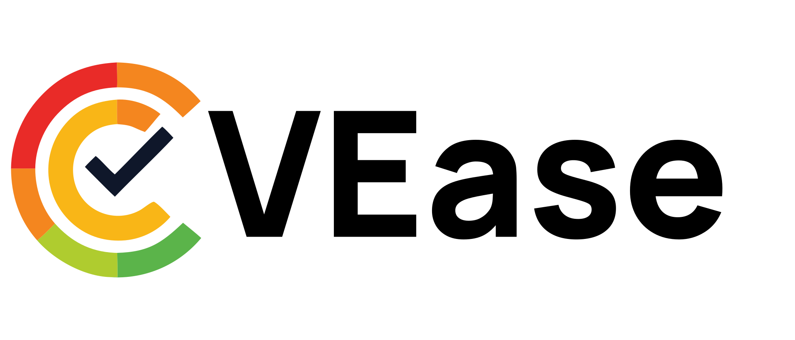
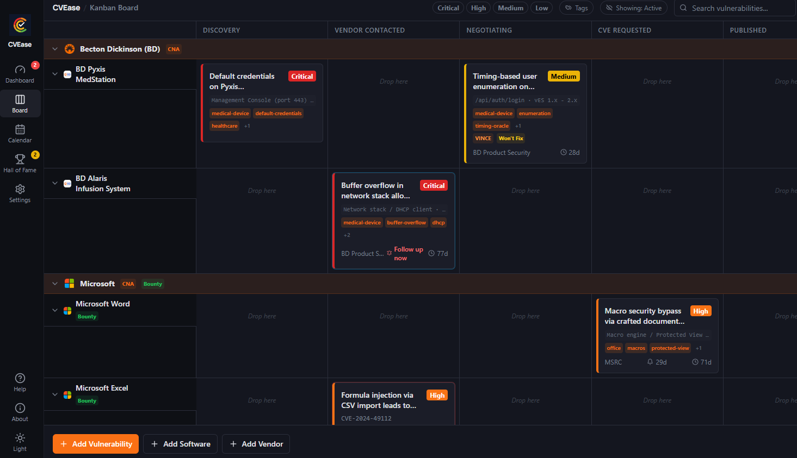
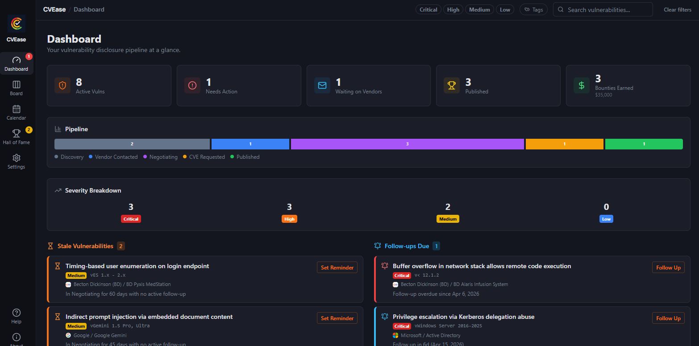
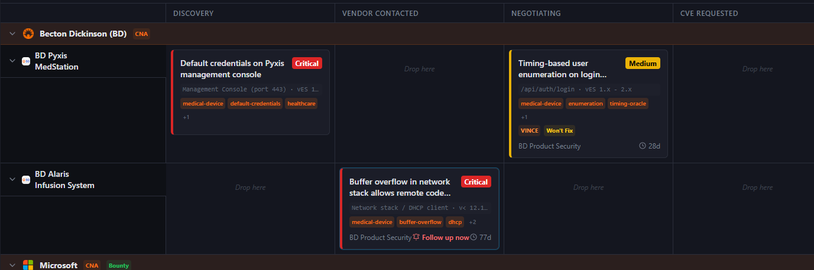
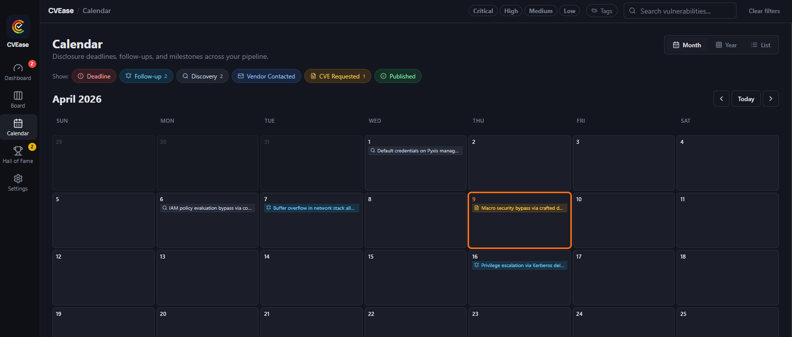
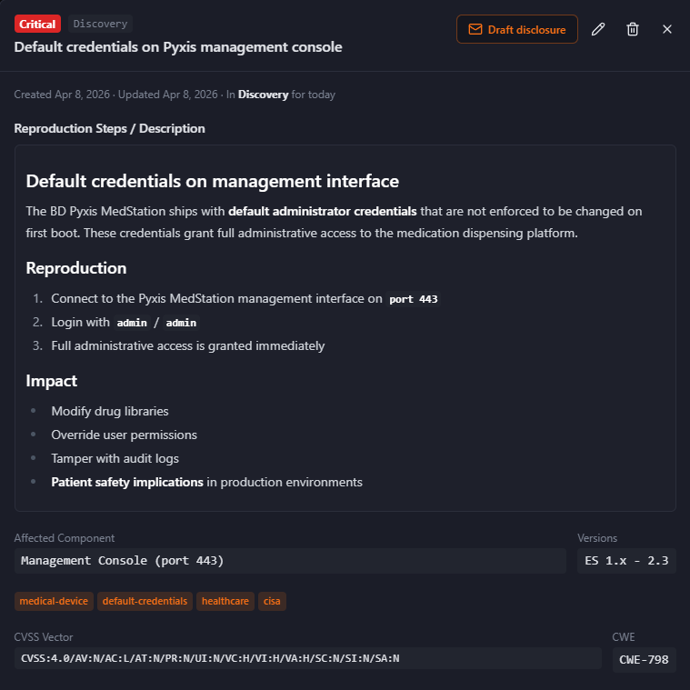
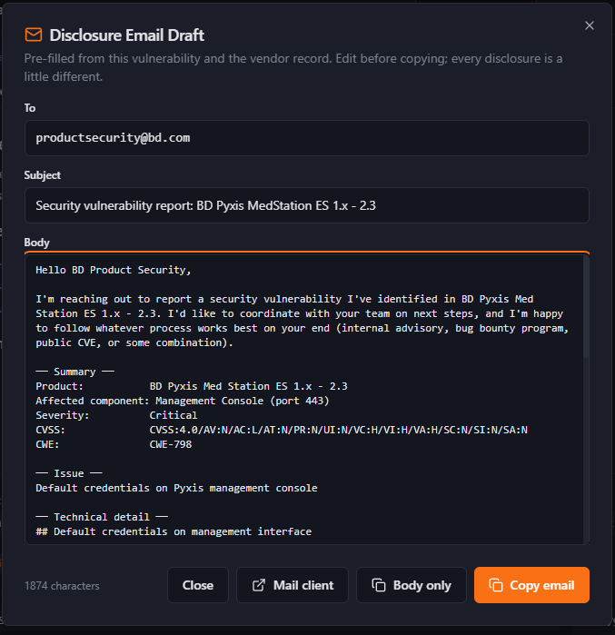
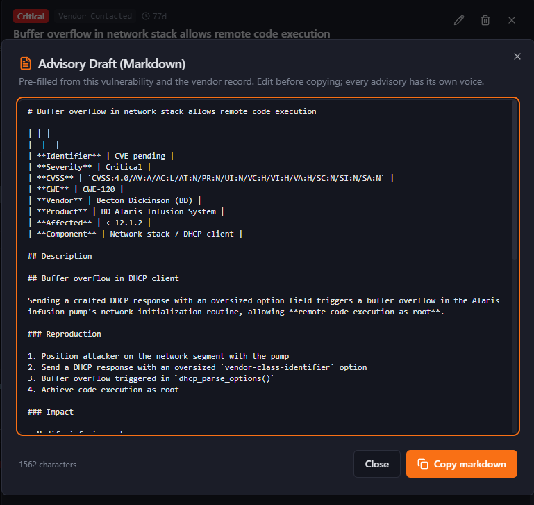

<p align="center">
  <picture>
    <source media="(prefers-color-scheme: dark)" srcset="docs/brand/CVEase-Full-Logo-DarkBackground.svg">
    
  </picture>
</p>

<p align="center">
  <strong>The desktop tool security researchers wish they had for tracking coordinated vulnerability disclosure.</strong>
</p>

<p align="center">
  <a href="https://github.com/marbas207/CVEase/releases/latest"></a>
  
  
</p>

---

## Why CVEase exists

If you've ever coordinated a vulnerability disclosure with a vendor, you know the pain. There's no de facto tool. Most researchers track this in spreadsheets, sticky notes, GitHub issues, or their email inbox. Which means:

- You miss follow-up dates and deadlines slip silently
- "Wait, did I email them already?" becomes a regular question
- Your disclosure work is invisible to anyone but you
- Switching between disclosures means switching context every time

CVEase is the tool you wish existed: **a local-first desktop app that takes you from discovery to publication and never bothers you until it matters**. It's built for the security researcher who's juggling 5 disclosures across 3 vendors and wants to put down their spreadsheet for good.

<p align="center">
  
</p>

## What it looks like

| Dashboard | Board | Calendar |
|-----------|-------|----------|
|  |  |  |

| Detail card | Draft disclosure | Draft advisory |
|-------------|------------------|----------------|
|  |  |  |

## Highlights

- **Stage progression you can drag.** Discovery → Vendor Contacted → Negotiating → CVE Requested → Published. Drop a card on a column and CVEase prompts for any required fields.
- **Follow-up discipline built in.** Set a reminder, get nudged. Overdue follow-ups surface on the dashboard, and OS notifications fire on the day a follow-up comes due. The app stays out of your way until it's time to act.
- **Stale CVE warnings.** If a vulnerability sits in the same in-flight stage for too long without an active follow-up, the dashboard surfaces it as the "you forgot about this" surface. Time-in-stage shows on every CVE detail panel.
- **Calendar with three views.** Month for planning, Year for the big picture, List for status reports. Six event kinds (deadline, follow-up, discovered, notified, requested, published) plotted against time, all filterable.
- **Drafts pre-filled from your data.** Click "Draft disclosure" and a coordinated-disclosure email is ready to copy into your mail client. Click "Draft advisory" when it's time to publish and a Markdown writeup is ready for your blog or GitHub Security Advisory.
- **LinkedIn post generator in Hall of Fame.** Once a CVE is published and archived, the Hall of Fame can spit out a ready-to-paste LinkedIn announcement with the timeline, severity, and credit baked in. Take the victory lap without writing the post.
- **Tags + filters.** Slice your CVEs by `embargoed`, `supply-chain`, `0day`, whatever you need. Once your tracker has more than 20 CVEs, this is the difference between scrolling and finding.
- **References list.** Attach the PoC repo, vendor advisory, NVD entry, and any related links to a CVE. Renders as clickable links on the detail panel and pulls into the advisory drafter automatically.
- **Vendor records that auto-fill.** Set up your vendors once with their security contacts, CNA status, and bug bounty programs. New CVEs you create pre-fill the contact info.
- **Markdown CVE descriptions.** Write your reproduction steps with code blocks, links, headers, the works.
- **CVSS 4.0 + CWE fields.** Paste vectors from the [FIRST calculator](https://www.first.org/cvss/calculator/4-0) (linked from the form). CWE field links straight to the matching MITRE definition page.
- **Bug bounty support.** Bounty status, amount, paid date, report URL. Dashboard shows total earned. Hall of Fame keeps your wins.
- **Hall of Fame for shipped CVEs.** Published vulnerabilities archive after 30 days, giving you a record of your published work in one place.
- **Local-first, no network.** Your data lives in a SQLite file in your userData folder. No telemetry. No accounts. Backup and restore from Settings.

## Hardening posture

CVEase takes its own threat model seriously, because security researchers are exactly the kind of users who notice when an app cuts corners:

- Electron sandbox enabled with explicit `contextIsolation`, `nodeIntegration: false`, strict CSP in production
- Every IPC handler validates inputs at the boundary via [zod](https://zod.dev/) schemas shared between main and renderer
- Path-traversal check on attachment opens
- `db:restore` requires confirmation and writes a pre-restore safety backup
- Type-to-confirm purge actions in the Danger Zone with auto-backup
- Top-level React error boundary catches renderer crashes
- Structured logging via [electron-log](https://github.com/megahertz/electron-log) writes to `userData/logs/`

## Download

| Platform | File |
|----------|------|
| Windows | `CVEase-Setup-x.y.z.exe` |
| macOS (Apple Silicon) | `CVEase-x.y.z-arm64.dmg` |
| macOS (Intel) | `CVEase-x.y.z-x64.dmg` |
| Linux | `CVEase-x.y.z.AppImage` |

Get the latest from **[Releases →](https://github.com/marbas207/CVEase/releases/latest)**

**macOS users:** the app is not yet notarized. After installing, either right-click the app and choose Open, or run:
```bash
xattr -cr /Applications/CVEase.app
```

## Getting started

On first launch, CVEase walks you through a quick **features tour** showing what each part of the app does. You can re-open it anytime from the Help button in the sidebar.

Then either:
- **Add your own data.** Start with a vendor in Settings, then a software product, then your first CVE.
- **Load demo data.** Click the "Load demo data" button to spin up 3 vendors, 5 products, and 9 realistic CVEs across all stages, with markdown descriptions, CVSS vectors, CWE IDs, and varied tags. A banner lets you clear it and start fresh anytime.

## Building from source

### Prerequisites
- Node.js 20+
- npm

### Install
```bash
git clone https://github.com/marbas207/CVEase.git
cd CVEase
npm install
```

### Development
```bash
npm run dev
```

### Tests
```bash
npm test          # runs vitest against the migration suite
npm run lint      # eslint
npm run build     # type-check + production build
```

### Package
```bash
npm run dist      # builds platform installers via electron-builder
```

## Tech stack

- [Electron 41](https://www.electronjs.org/) + [electron-vite 5](https://electron-vite.org/) + [Vite 7](https://vite.dev/)
- [React 18](https://react.dev/) + [TypeScript 5](https://www.typescriptlang.org/) + [react-router-dom 6](https://reactrouter.com/)
- [Tailwind CSS 3](https://tailwindcss.com/) + [shadcn/ui](https://ui.shadcn.com/) + [Radix UI](https://www.radix-ui.com/)
- [react-hook-form](https://react-hook-form.com/) + [zod](https://zod.dev/) (validation shared between main and renderer)
- [Zustand](https://zustand.docs.pmnd.rs/) with persist middleware
- [better-sqlite3](https://github.com/WiseLibs/better-sqlite3) for storage, [@dnd-kit](https://dndkit.com/) for the kanban board
- [react-markdown](https://github.com/remarkjs/react-markdown) + [@tailwindcss/typography](https://tailwindcss.com/docs/typography-plugin) for description rendering
- [electron-log](https://github.com/megahertz/electron-log) for structured logging
- [vitest 4](https://vitest.dev/) for the migration test suite

## Author

Created by **marba$**

- GitHub: [marbas207](https://github.com/marbas207)
- Buy Me a Coffee: [marbas](https://buymeacoffee.com/marbas)

## License

All rights reserved.
